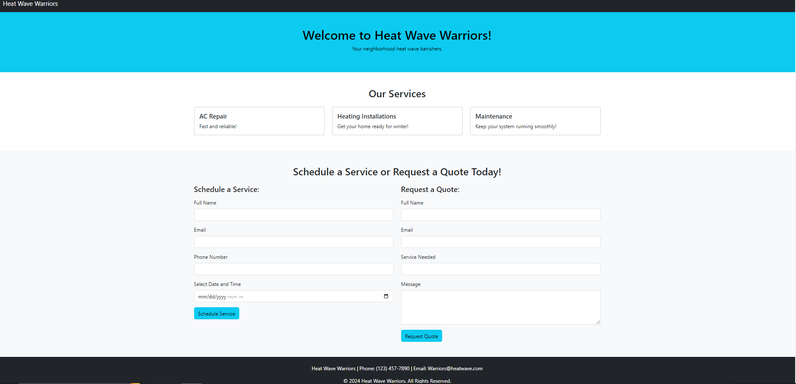

## 📋 <a name="table">Table of Contents</a>

1. [Introduction](#introduction)
2. [Tech Stack](#tech-stack)
3. [Features](#features)
4. [Quick Start](#quick-start)
5. [Code Snippets to Copy](#snippets)
6. [More](#more)

## <a name="introduction">Introduction</a>

This full-stack website, utilizing the MVC approach, is built using MongoDB, Node.js, Express, HTML, and Bootstrap, with integrated email functionality through Nodemailer and Mailtrap. The platform allows customers to schedule services and request quotes through simple, user-friendly forms. The data submitted is securely stored in a database, and customers receive a confirmation email upon successful form submission. The system ensures an efficient and professional interaction, guiding users to a thank you page after completion.



## <a name="tech-stack">Tech Stack</a>

- MongoDB
- Mongoose
- Express
- Node.js
- HTML
- Bootstrap
- Mailtrap

## <a name="features">Features</a>

👉 **Customer Database**: Each service request is added to a database that is viewed by the company.

👉 **Automated Emails**: Integrates mailtrap and nodemailer to send schedule and quote confirmations.

## <a name="quick-start">Quick Start</a>

Follow these steps to set up the project locally on your machine.

**Prerequisites**

The following will need to be installed:

- [Node.js](https://nodejs.org/en)
- [npm](https://www.npmjs.com/) (Node Package Manager)
- [Nodemailer](https://nodemailer.com/)
- [Mailtrap](https://mailtrap.io/)
- [Bootstrap](https://getbootstrap.com/)
- [MongoDB](https://www.mongodb.com/)
- [Mongoose](https://mongoosejs.com/)

**Cloning the Repository**

```bash
git clone https://github.com/AvionShea/HVAC.git
cd HVAC
```

**Installation**

Install the project dependencies using npm:

```bash
npm i dotenv express mailtrap mongoose nodemailer
```

**Set Up Environment Variables**

Create a new file named `.env` in the root of your project and add the following content:

```env
DB_CONNECTION =
MAIL_TOKEN =
```

**Running the Project**

```bash
npm start
```

**Terminate running Project (batch job)**

```bash
Ctrl C
```

Navigate to http://localhost:PORT_NUMBER/

## <a name="snippets">Snippets</a>

<details>
<summary><code>Server File</code></summary>

```javascript
const express = require("express");
const mongoose = require("mongoose");
const dotenv = require("dotenv");
const apiRoutes = require("./routes/router");

dotenv.config();

const app = express();

app.use(express.urlencoded({ extended: true }));
app.use(express.json());

app.use(express.static("views"));

app.use("/api", apiRoutes);

mongoose
  .connect(process.env.DB_CONNECTION)
  .then(() => console.log("MongoDB connected successfully!"))
  .catch((err) => console.log(err));

const PORT = process.env.PORT || 3000;
app.listen(PORT, () => console.log(`Server running on port ${PORT}...`));
```

</details>

## <a name="more">Author</a>

- LinkedIn - [@avion-cobb](https://www.linkedin.com/in/avion-cobb/)
- Twitter - [@Blvck_Lotus003](https://twitter.com/Blvck_Lotus003)
